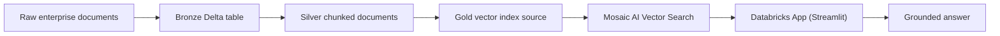

# document-rag-databricks

Este projeto mostra como montar uma **RAG documental usando o ecossistema Databricks de ponta a ponta**.

Ele foi desenhado para representar um fluxo completo de lakehouse:

- ingestão de documentos em tabelas Delta;
- organização em camadas `bronze`, `silver` e `gold`;
- governança via `Unity Catalog`;
- tabela-fonte para **Mosaic AI Vector Search**;
- app em **Streamlit** no estilo **Databricks Apps**;
- e uma rota local reproduzível para manter o repositório executável no GitHub.

Hoje o projeto já existe em duas formas complementares:

- uma **versão local reproduzível**, ideal para GitHub, testes e demonstrações rápidas;
- uma **versão conectada ao Databricks real**, com `Unity Catalog`, `Delta tables`, `Mosaic AI Vector Search` e `Databricks Apps`.

## Storytelling básico

Quando uma empresa quer construir um assistente de documentação, normalmente ela precisa mais do que um chatbot. Ela precisa de:

- um lugar governado para guardar os documentos;
- um pipeline para quebrar e preparar o conteúdo;
- um índice vetorial para recuperação semântica;
- uma interface final para consulta;
- e um caminho claro entre dado bruto e resposta final.

Esse projeto existe para mostrar exatamente isso.

## Base pública escolhida

A inspiração da base foi:

- [ibm-research/watsonxDocsQA](https://huggingface.co/datasets/ibm-research/watsonxDocsQA)

Motivo da escolha:

- é um dataset voltado para **document QA / RAG**;
- tem corpus documental e benchmark de perguntas;
- usa documentação corporativa, o que combina muito bem com um caso de uso de Databricks em ambiente enterprise;
- tem licença `Apache 2.0`.

No repositório, eu mantive uma amostra local `watsonxDocsQA-style` para deixar o projeto leve e reproduzível.

## O que o projeto cobre do ecossistema Databricks

- **Delta Lake**
- **bronze / silver / gold**
- **Unity Catalog**
- **Delta Change Data Feed**
- **Mosaic AI Vector Search**
- **Databricks Apps com Streamlit**
- **Databricks Asset Bundles**

## Arquitetura



## Camadas do lakehouse

### Bronze
Representa a ingestão documental crua.

Exemplos de colunas:
- `doc_id`
- `url`
- `title`
- `document`
- `md_document`
- `ingested_at`

Objetivo:
- preservar o documento como entrou;
- manter rastreabilidade;
- permitir reprocessamento.

### Silver
Representa a camada de transformação.

O documento é quebrado em chunks com metadados como:
- `chunk_id`
- `doc_id`
- `chunk_order`
- `chunk_text`

Objetivo:
- preparar o conteúdo para retrieval;
- preservar fronteiras semânticas;
- melhorar precisão do RAG.

### Gold
Representa a camada pronta para indexação vetorial.

Exemplos de colunas:
- `chunk_id`
- `doc_id`
- `title`
- `url`
- `chunk_text`
- `embedding`

Objetivo:
- servir como tabela-fonte para o índice vetorial;
- desacoplar a indexação da etapa de chunking;
- permitir atualização incremental.

## Papel do Unity Catalog

Neste projeto, o `Unity Catalog` aparece como a camada conceitual de governança do fluxo:

- catálogo e schema para as tabelas do pipeline;
- permissões para consulta e leitura;
- integração com o app;
- integração com o índice vetorial.

Isso é importante porque o valor do Databricks não está só no compute. Está também em unir dados, governança e IA dentro da mesma plataforma.

## Papel do Delta Change Data Feed

O projeto também considera o uso de `Change Data Feed` no Delta, porque ele é especialmente útil quando o índice vetorial precisa ser atualizado sem reconstrução total.

No fluxo real:

- a tabela Delta registra alterações;
- apenas os documentos/chunks alterados são propagados;
- a tabela `gold` pode ser atualizada incrementalmente;
- o índice vetorial pode ser sincronizado com menos custo.

## Papel do Mosaic AI Vector Search

O **Mosaic AI Vector Search** é a peça que transforma a tabela `gold` em um índice de recuperação semântica.

No fluxo de produção:

1. a tabela `gold` contém texto + embedding + metadados;
2. um endpoint vetorial é criado;
3. um índice é criado a partir da tabela Delta;
4. o app consulta esse índice para recuperar chunks semanticamente próximos da pergunta.

## Papel do Databricks App com Streamlit

O app final representa a camada de experiência do usuário.

Ele pode:

- receber a pergunta;
- consultar a base vetorial;
- exibir os chunks mais relevantes;
- montar uma resposta grounded;
- mostrar links, títulos e evidências.

Neste repositório, a interface em `Streamlit` funciona em dois modos:

- **modo Databricks real**: consulta o índice `workspace.document_rag.document_rag_index`;
- **modo local**: usa o fallback lexical reproduzível se o runtime Databricks não estiver disponível.

Isso deixa a demo mais honesta e mais útil: o mesmo app serve tanto para o GitHub quanto para o workspace real.

## API e app compartilham a mesma lógica

Uma melhoria importante deste projeto é que:

- a API em [app.py](/Users/flaviagaia/Documents/CV_FLAVIA_CODEX/document-rag-databricks/app.py)
- e a interface em [streamlit_app.py](/Users/flaviagaia/Documents/CV_FLAVIA_CODEX/document-rag-databricks/streamlit_app.py)

usam a mesma camada de execução híbrida em [runtime_query.py](/Users/flaviagaia/Documents/CV_FLAVIA_CODEX/document-rag-databricks/src/runtime_query.py).

Na prática, isso significa:

- se o projeto estiver rodando no Databricks, ele tenta usar `Vector Search`;
- se o índice ainda estiver aquecendo ou se houver algum erro transitório, ele volta para o fallback local;
- o comportamento fica consistente entre frontend e backend.

## Estrutura do repositório

- [main.py](/Users/flaviagaia/Documents/CV_FLAVIA_CODEX/document-rag-databricks/main.py)  
  Executa o pipeline local ponta a ponta.

- [app.py](/Users/flaviagaia/Documents/CV_FLAVIA_CODEX/document-rag-databricks/app.py)  
  API local simples para consulta.

- [streamlit_app.py](/Users/flaviagaia/Documents/CV_FLAVIA_CODEX/document-rag-databricks/streamlit_app.py)  
  Interface de demo no estilo de um app de consulta documental.

- [src/sample_data.py](/Users/flaviagaia/Documents/CV_FLAVIA_CODEX/document-rag-databricks/src/sample_data.py)  
  Gera a amostra local inspirada no `watsonxDocsQA`.

- [src/rag_pipeline.py](/Users/flaviagaia/Documents/CV_FLAVIA_CODEX/document-rag-databricks/src/rag_pipeline.py)  
  Faz chunking, retrieval local, grounding e artefato final.

- [src/runtime_query.py](/Users/flaviagaia/Documents/CV_FLAVIA_CODEX/document-rag-databricks/src/runtime_query.py)  
  Centraliza a decisão entre `Vector Search` real e fallback local.

- [databricks.yml](/Users/flaviagaia/Documents/CV_FLAVIA_CODEX/document-rag-databricks/databricks.yml)  
  Exemplo de Asset Bundle para orquestração do pipeline.

- [notebooks/01_bronze_ingestion.py](/Users/flaviagaia/Documents/CV_FLAVIA_CODEX/document-rag-databricks/notebooks/01_bronze_ingestion.py)  
  Exemplo de notebook Databricks para ingestão bronze.

- [notebooks/02_silver_chunking.py](/Users/flaviagaia/Documents/CV_FLAVIA_CODEX/document-rag-databricks/notebooks/02_silver_chunking.py)  
  Exemplo de notebook de chunking.

- [notebooks/03_gold_index_source.py](/Users/flaviagaia/Documents/CV_FLAVIA_CODEX/document-rag-databricks/notebooks/03_gold_index_source.py)  
  Exemplo de notebook para publicação da tabela-fonte do índice.

- [notebooks/04_query_vector_search.py](/Users/flaviagaia/Documents/CV_FLAVIA_CODEX/document-rag-databricks/notebooks/04_query_vector_search.py)  
  Exemplo de consulta ao Mosaic AI Vector Search.

- [sql/](/Users/flaviagaia/Documents/CV_FLAVIA_CODEX/document-rag-databricks/sql)  
  Scripts SQL para schema, tabelas Delta e notas do índice vetorial.

## Execução local

```bash
python3 main.py
```

API local:

```bash
uvicorn app:app --reload
```

Interface de demo:

```bash
streamlit run streamlit_app.py
```

## Resultado atual

- `dataset_source = watsonxdocsqa_style_local_sample`
- `runtime_mode = local_retrieval_fallback`
- `document_count = 6`
- `qa_count = 2`
- `chunk_count >= 6`
- `top_doc_id = DOC-1002`

## Estado validado no Databricks real

No workspace pessoal em que este projeto foi validado, o estado final ficou assim:

- catálogo: `workspace`
- schema: `workspace.document_rag`
- tabelas Delta:
  - `workspace.document_rag.bronze_documents`
  - `workspace.document_rag.silver_document_chunks`
  - `workspace.document_rag.gold_vector_index_source`
- índice vetorial:
  - `workspace.document_rag.document_rag_index`
- endpoint vetorial:
  - `document-rag-endpoint`
- app:
  - `document-rag-app`

Snapshot validado:

- `bronze_documents = 6`
- `silver_document_chunks = 12`
- `gold_vector_index_source = 12`
- `document_rag_index indexed_row_count = 12`
- `document_rag_index ready = true`
- `document-rag-app status = RUNNING`

## Variáveis e contrato do app

O app Databricks usa:

- `VECTOR_SEARCH_INDEX`

Valor padrão:

- `workspace.document_rag.document_rag_index`

Se a variável não existir, o código já usa esse mesmo índice como default.

## Fluxo operacional real

No runtime Databricks, o caminho esperado é:

1. documentos entram na `bronze`;
2. o chunking publica trechos na `silver`;
3. a tabela `gold` vira a fonte do índice vetorial;
4. o app pergunta ao índice vetorial;
5. o usuário recebe resposta grounded + evidência textual.

Se a consulta vetorial falhar temporariamente:

1. a camada híbrida registra o erro;
2. faz fallback para a amostra local;
3. mantém a demo responsiva em vez de simplesmente quebrar.

## O que esse projeto demonstra

- arquitetura de RAG documental no estilo Databricks;
- separação clara entre ingestão, chunking e indexação;
- fluxo pronto para Vector Search;
- interface de consulta;
- ponte clara entre demo local e stack real de plataforma.

## Leitura extremamente técnica

O projeto foi intencionalmente desenhado com duas realidades:

### 1. Runtime local reproduzível
Usado para:

- execução no GitHub;
- testes automatizados;
- demonstração rápida;
- validação de contrato.

Nesse modo:

- a base é uma amostra local;
- o retrieval é um fallback lexical determinístico;
- a resposta grounded é montada sobre os chunks retornados.

### 2. Runtime Databricks de produção
Pensado para:

- Delta tables no Unity Catalog;
- Change Data Feed para atualização incremental;
- Mosaic AI Vector Search;
- app com Streamlit no Databricks Apps;
- governança integrada.

O ganho desse desenho é que ele separa muito bem:

- **data plane**
- **vector retrieval plane**
- **application plane**

Também existe uma separação importante entre:

- **runtime path**
  - lógica que decide se a consulta vai para o Databricks real ou para o fallback local
- **retrieval path**
  - consulta vetorial quando o índice está disponível
- **resilience path**
  - fallback seguro quando o índice ainda não está pronto ou quando o ambiente não expõe a SDK/credenciais esperadas

Esse desenho é especialmente útil em ambientes enterprise porque reduz o risco de demos frágeis e melhora muito a transição entre desenvolvimento local e deployment real.

Isso deixa o projeto mais próximo de uma arquitetura real de enterprise RAG.

## Referências oficiais usadas no desenho

- [Mosaic AI Vector Search overview](https://docs.databricks.com/gcp/en/generative-ai/vector-search)
- [Create vector search endpoints and indexes](https://docs.databricks.com/gcp/generative-ai/create-query-vector-search)
- [Use Delta Lake change data feed](https://docs.databricks.com/en/delta/delta-change-data-feed.html)
- [Databricks Apps with Streamlit](https://docs.databricks.com/aws/en/dev-tools/databricks-apps/tutorial-streamlit)
- [watsonxDocsQA dataset](https://huggingface.co/datasets/ibm-research/watsonxDocsQA)

## English

This project shows how to build a **document RAG architecture using the Databricks ecosystem end to end**.

It is structured around:

- Delta Lake ingestion
- bronze / silver / gold layering
- Unity Catalog governance
- Delta Change Data Feed for incremental refresh
- Mosaic AI Vector Search as the retrieval layer
- Streamlit as the Databricks App experience

The repository also includes a **local reproducible fallback** so the project remains runnable on GitHub without requiring a live Databricks workspace.
